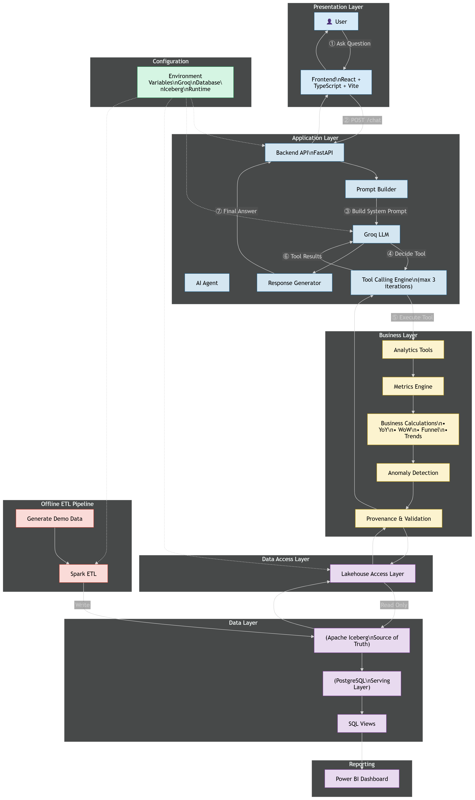
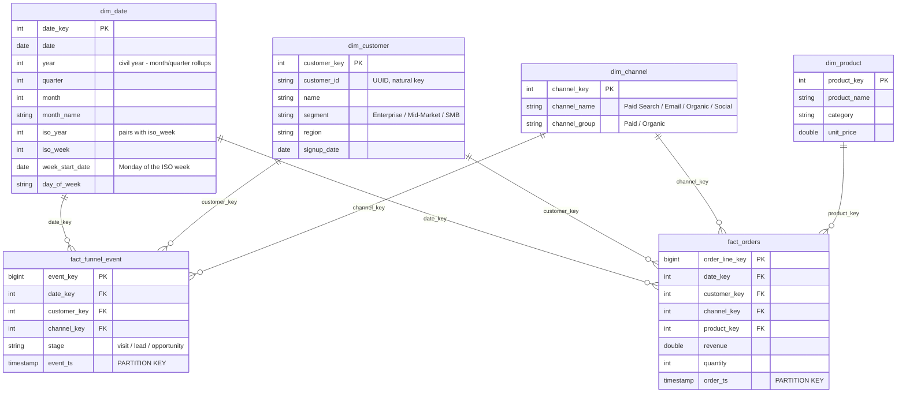

# Customer Journey Funnel Tracker

A lakehouse-backed analytics stack for a marketing funnel (`visit → lead → opportunity → order`), fronted by an AI analyst that **cannot state a number without citing the Iceberg snapshot it came from**.

Data lands in Apache Iceberg, is served to Power BI through Postgres, and is queried by an LLM agent that reaches the data **only** through an MCP tool server. Every figure the agent reports carries a provenance envelope — snapshot id, commit time, date range, source tables, and the calculation in words.

---

## Table of Contents

- [Project Overview](#project-overview)
- [Features](#features)
- [Tech Stack](#tech-stack)
- [Architecture Overview](#architecture-overview)
- [Data Model](#data-model)
- [Project Structure](#project-structure)
- [Prerequisites](#prerequisites)
- [Installation](#installation)
- [Environment Variables](#environment-variables)
- [Running the Project](#running-the-project)
- [Usage & Demo Script](#usage--demo-script)
- [API / LLM / Tool Integrations](#api--llm--tool-integrations)
- [Analytics & Business Logic](#analytics--business-logic)
- [Key Forensic Findings](#key-forensic-findings)
- [Configuration](#configuration)
- [Known Limitations](#known-limitations)
- [Future Improvements](#future-improvements)
- [Self-Reflection](#self-reflection)
- [Requirements Coverage](#requirements-coverage)
- [Troubleshooting](#troubleshooting)

---

## Project Overview

### Business scenario

A marketing team runs a four-stage funnel and needs to answer questions like *"how does this week's lead funnel compare to the same week last year?"* without waiting on an analyst. The catch: an LLM that guesses a number is worse than no answer at all, because a plausible fabricated figure gets pasted into a deck and acted on.

This project's position is that **traceability is the product**. The agent is built so that a number and its receipts travel together, and so the receipts are rendered in the UI rather than left to the model's goodwill.

### Primary objectives

1. **Iceberg as the source of truth** — versioned, snapshotted, time-travellable; the only store that can answer *"as of which snapshot?"*
2. **Partition evolution without rewriting history** — evolve `day(event_ts)` → `month(event_ts)` as a metadata-only operation, and prove old files were neither moved nor rewritten.
3. **An MCP tool server**, not raw function-calling — the agent talks the Model Context Protocol to reach the lakehouse.
4. **Provenance as a hard contract** — enforced in code (`dispatch()` raises if a tool returns no provenance), not merely requested in a prompt.
5. **A governed semantic layer** — one definition of "a week", "a lead", "revenue", shared by Power BI, SQL, and the agent.

---

## Features

| Feature | Where it lives |
|---|---|
| Synthetic star-schema generator (reproducible, seeded) | `src/data_generation/` |
| Spark → Iceberg load, day-partitioned facts | `src/elt/load_iceberg.py` |
| Metadata-only partition evolution (day → month) | `src/elt/evolve_partition.py` |
| Postgres serving copy for Power BI | `src/elt/serve_postgres.py` |
| Governed SQL views (semantic layer) | `sql/views.sql` |
| MCP server exposing 8 read-only metric tools | `src/agent/mcp_server.py` |
| FastAPI chat backend (Groq + MCP client) | `src/agent/server.py` |
| Provenance envelope on every numeric result | `src/agent/metrics.py` |
| React chat UI with expandable provenance cards | `frontend/src/components/` |
| Iceberg time travel (`compare_as_of`) | `src/agent/metrics.py` |
| Query-plan self-explanation (`explain_scan`) | `src/agent/metrics.py` |
| File-pruning & immutability forensics | `src/validation/`, `docs/forensics/` |
| Power BI report + custom theme | `powerbi/` |

> **Note:** a proactive week-over-week anomaly opener is implemented in `metrics.funnel_anomalies()` and wired into `server.py`, but is **not currently reachable** — see [Known Limitations](#known-limitations).

---

## Tech Stack

| Layer | Technology |
|---|---|
| Language | Python 3.12.10 (pinned via `.python-version`) |
| Package manager | `uv` (`pyproject.toml` + `uv.lock`) |
| Lakehouse | Apache Iceberg 1.11.0, Hadoop catalog (directory tree, no metastore) |
| Write / ELT engine | PySpark 4.1.2 (`iceberg-spark-runtime-4.1_2.13`) |
| Read engine (agent) | PyIceberg 0.8 (`StaticTable`) + DuckDB over Arrow (zero-copy) |
| Serving DB | PostgreSQL 16 (Docker) |
| BI | Power BI (`.pbix` + custom theme) |
| Tool protocol | **MCP** (`mcp>=1.28`), stdio transport |
| LLM | Groq — `llama-3.1-8b-instant`, via the OpenAI-compatible SDK |
| API | FastAPI + Uvicorn, Pydantic models |
| Frontend | React 19, TypeScript, Vite 8, TanStack Query, react-markdown |
| Tests | pytest |

---

## Architecture Overview (Architecture Diagram is attached below)

```
┌──────────────────────┐
│  data_generation/    │  Faker + fixed seed (42 / 43)
│  generate_data.py    │  → deterministic CSVs
└──────────┬───────────┘
           │  data/raw/*.csv
           ▼
┌──────────────────────┐
│  elt/load_iceberg.py │  PySpark 4.1, Hadoop catalog
│                      │  facts partitioned by day(ts)
└──────────┬───────────┘
           │
           ▼
┌───────────────────────────────────────────────┐
│         APACHE ICEBERG  (warehouse/db)        │  ◀── SOURCE OF TRUTH
│  snapshots · manifests · time travel          │      append-only history
│                                               │
│  elt/evolve_partition.py:                     │
│      day(event_ts) ──▶ month(event_ts)        │  metadata-only, no rewrite
└───────┬───────────────────────────┬───────────┘
        │                           │
        │ Spark                     │ PyIceberg StaticTable (READ-ONLY)
        ▼                           ▼
┌────────────────────┐    ┌──────────────────────┐
│ elt/serve_postgres │    │  agent/lakehouse.py  │
│  Postgres 16       │    │  + DuckDB over Arrow │
│  + sql/views.sql   │    └──────────┬───────────┘
└─────────┬──────────┘               │
          │                          ▼
          ▼               ┌──────────────────────┐
   ┌─────────────┐        │   agent/metrics.py   │  every result wrapped in
   │  Power BI   │        │   + agent/tools.py   │  a PROVENANCE envelope
   │  .pbix      │        └──────────┬───────────┘  (dispatch() enforces it)
   └─────────────┘                   │
                                     ▼
                          ┌──────────────────────┐
                          │  agent/mcp_server.py │  MCP over stdio, 8 tools
                          └──────────┬───────────┘
                                     │  MCP protocol
                                     ▼
                          ┌──────────────────────┐
                          │  agent/mcp_client.py │
                          │  agent/server.py     │  FastAPI :8000
                          └──────────┬───────────┘
                                     │  ▲
                            tool_calls│  │ Groq llama-3.1-8b-instant
                                     ▼  │ (OpenAI-compatible API)
                          ┌──────────────────────┐
                          │  frontend/ (Vite)    │  React 19 :5173
                          │  Chat + Provenance   │
                          └──────────────────────┘
```



### Two stores, on purpose

**Iceberg is the truth.** Postgres is a *disposable serving copy* that exists only because Power BI's Postgres connector is reliable and its Iceberg story is not. If Postgres drifts, drop it and re-run `serve_postgres.py`.

Critically, **the agent does not read Postgres** — it reads Iceberg directly, because that is the only way it can cite a snapshot id.

### Why the agent never boots Spark

`src/agent/lakehouse.py` deliberately avoids `load_catalog()`. PyIceberg 0.8 registers only `rest`, `hive`, `glue`, `dynamodb`, and `sql` catalog types — `hadoop` is not among them, and the call dies with `KeyError: 'HADOOP'`. Instead the agent reads `version-hint.text`, resolves the matching `vN.metadata.json`, and hands it to a `StaticTable`: a read-only table needing no catalog, which **physically cannot commit**. Booting Spark per chat turn would add ~10s of JVM startup to every question; PyIceberg + DuckDB answers in milliseconds.

> **Brief requirement:** the architecture diagram should be exported as an **image** (Excalidraw / draw.io / photo) into the repo. That image is **not present** — `docs/architecture.md` and `docs/erd.md` are currently **empty files**. The ASCII diagram above and the ERD below are the working substitutes.

---

## Data Model

A classic star schema: two fact tables, four conformed dimensions.



Column names and types have a single source of truth in `src/data_generation/schemas.py`, imported by both the generator and the Spark loader (so the loader never uses `inferSchema`).

### The `iso_year` rule — the bug this project shipped with

> **The week key is `(iso_year, iso_week)`. Never `(year, iso_week)`.**

The calendar year and the ISO year disagree at year boundaries:

| date | civil year | ISO year | ISO week |
|---|---|---|---|
| 2022-01-01 | 2022 | **2021** | 52 |
| 2024-12-30 | 2024 | **2025** | 1 |

Keying weekly metrics on `(year, iso_week)` merges January into December — producing a single "week" spanning **364 days**. This is enforced in three places: `dim_date.py` (one row builder, so the two generators cannot drift), `sql/views.sql`, and a regression test asserting no ISO week spans more than 7 days.

### Grain caveat

`fact_orders` has **no order id** — `COUNT(*)` counts *order lines*. One multi-line order counts once per line. That is the only "deal" grain the data supports, so `avg_deal_size` means *average revenue per order line*.

---

## Project Structure

```
customer-journey-funnel-tracker/
├── src/
│   ├── data_generation/
│   │   ├── schemas.py              # SINGLE SOURCE OF TRUTH for the star schema
│   │   ├── dim_date.py             # one dim_date row builder (the iso_year fix)
│   │   ├── generate_data.py        # base dataset, seed 42, 2022-01-03 → 2025-12-31
│   │   └── generate_new_batch.py   # 2026 incremental batch, seed 43, shifted rates
│   ├── elt/
│   │   ├── load_iceberg.py         # Spark → Iceberg, facts partitioned by day(ts)
│   │   ├── evolve_partition.py     # day → month, metadata-only + append new batch
│   │   └── serve_postgres.py       # Iceberg → Postgres serving copy for Power BI
│   ├── agent/
│   │   ├── lakehouse.py            # read-only Iceberg access (StaticTable + DuckDB)
│   │   ├── metrics.py              # THE METRIC ENGINE — every number + provenance
│   │   ├── tools.py                # tool registry, arg coercion, dispatch guardrail
│   │   ├── mcp_server.py           # MCP server over stdio (read-only)
│   │   ├── mcp_client.py           # MCP client used by the FastAPI backend
│   │   ├── prompts.py              # system prompt, guardrails, suggested prompts
│   │   └── server.py               # FastAPI /chat, /health, /suggested-prompts
│   └── validation/
│       ├── check_file_pruning.py           # plan_files() with/without predicate
│       ├── check_evolution_immutability.py # snapshot history + Spark plans
│       ├── check_partition_layout.sh       # on-disk day vs month file counts
│       └── run_metrics.py                  # executes sql/metrics.sql vs Postgres
├── sql/
│   ├── views.sql                   # governed semantic layer (vw_*)
│   └── metrics.sql                 # running totals: WTD / MTD / YTD
├── frontend/                       # React 19 + Vite chat UI
│   └── src/
│       ├── api.ts                  # typed client (Provenance, ToolCall, ChatResponse)
│       └── components/
│           ├── Chat.tsx            # chat surface, markdown, suggested prompts
│           └── ProvenanceCard.tsx  # the receipts, rendered — not trusted to prose
├── docs/
│   ├── architecture.md             # EMPTY — see Known Limitations
│   ├── erd.md                      # EMPTY — see Known Limitations
│   └── forensics/
│       ├── check_file_pruning_evidence.md
│       └── partition_evolution_evidence.md
├── tests/test_metrics.py           # ISO-week grain + the traceability contract
├── powerbi/                        # funnel_tracker_report.pbix, theme.json, logo
├── data/raw/                       # generated CSVs (gitignored)
├── warehouse/                      # Iceberg Hadoop catalog (gitignored)
├── docker-compose.yml              # Postgres 16
├── pyproject.toml / uv.lock
└── main.py                         # stub ("Hello from ...") — not an entrypoint
```

---

## Prerequisites

| Requirement | Notes |
|---|---|
| Python **3.12.10** | pinned in `.python-version` |
| [`uv`](https://docs.astral.sh/uv/) | dependency management |
| **Java 17+ (JDK)** | required by PySpark 4.1 — needed for ELT, *not* for the agent |
| Docker + Docker Compose | for the Postgres serving layer |
| Node.js 20+ | for the Vite frontend |
| A **Groq API key** | free tier is sufficient — <https://console.groq.com> |
| Power BI Desktop | *optional*, to open `powerbi/funnel_tracker_report.pbix` |

Internet access is needed on the first Spark run: `spark.jars.packages` resolves the Iceberg runtime JAR from Maven Central.

---

## Installation

```bash
git clone <repository-url>
cd customer-journey-funnel-tracker

# Python dependencies
uv sync

# Frontend dependencies
cd frontend && npm install && cd ..

# Environment
cp .env.example .env
#   then edit .env and set GROQ_API_KEY
```

---

## Environment Variables

Copy `.env.example` → `.env`. Never commit `.env` (it is gitignored).

| Variable | Purpose | Example / default |
|---|---|---|
| `POSTGRES_HOST` | Serving DB host | `localhost` |
| `POSTGRES_PORT` | Serving DB port | `5432` |
| `POSTGRES_DB` | Database name — must match `docker-compose.yml` | `funnel` |
| `POSTGRES_USER` | Database user | `funnel` |
| `POSTGRES_PASSWORD` | Database password | `funnel` |
| `ICEBERG_WAREHOUSE` | Iceberg warehouse path. **Use a relative path** (`warehouse`) — it is portable and anchored to the repo root | `warehouse` |
| `ICEBERG_NAMESPACE` | Iceberg namespace (read by the agent; defaults if unset) | `db` |
| `GROQ_API_KEY` | **Secret.** Groq API key | `gsk_your-key-here` |
| `GROQ_BASE_URL` | OpenAI-compatible endpoint | `https://api.groq.com/openai/v1` |
| `GROQ_MODEL` | Model id | `llama-3.1-8b-instant` |
| `CORS_ORIGINS` | Comma-separated allowlist (**not** `*`) | `http://localhost:5173` |
| `MAX_TOOL_ROWS` | Ceiling on rows any tool may return, so a vague question cannot pull the whole fact table into the context window | `500` |
| `ANOMALY_THRESHOLD_PCT` | WoW % drop before a stage/conversion is flagged. A business judgement, not a technical one: too low and every session opens with noise nobody acts on | `20` |
| `DAILY_VISITS` | Mean visits/day in the generator | `120` |
| `VITE_API_URL` | **`frontend/.env`** — backend base URL | `http://localhost:8000` |

> ⚠️ **`ICEBERG_WAREHOUSE` must be valid on *this* machine.** Iceberg's Hadoop-catalog metadata stores **absolute** locations (e.g. `file:///D:/.../warehouse/db/dim_date`). A warehouse built on another machine or OS is **not portable** — see [Troubleshooting](#troubleshooting).

---

## Running the Project

### Development — full pipeline, from a clean clone

```bash
# 0. Environment
cp .env.example .env          # set GROQ_API_KEY; set ICEBERG_WAREHOUSE=warehouse
uv sync

# 1. Start Postgres
docker compose up -d

# 2. Generate the synthetic dataset  →  data/raw/*.csv
uv run python src/data_generation/generate_data.py
uv run python src/data_generation/generate_new_batch.py

# 3. Load Iceberg (facts partitioned by day)   [needs Java]
uv run python src/elt/load_iceberg.py

# 4. Partition evolution: day → month, then append the 2026 batch
uv run python src/elt/evolve_partition.py

# 5. Publish the Postgres serving copy + governed views (for Power BI)
uv run python src/elt/serve_postgres.py

# 6. Verify
uv run pytest tests/ -v
uv run python -m src.validation.check_file_pruning
bash src/validation/check_partition_layout.sh
```

Steps 2–4 must run in order: `evolve_partition.py` alters a table that `load_iceberg.py` creates.

### Run the agent

Two processes. The MCP server is **not** one of them — `server.py` spawns it as a subprocess at boot (once, not per request; re-reading Iceberg metadata every turn would add seconds to each message).

```bash
# Terminal 1 — backend
uv run uvicorn src.agent.server:app --reload --port 8000

# Terminal 2 — frontend
cd frontend && npm run dev
```

Open <http://localhost:5173>. Check the backend with `curl localhost:8000/health` — it reports the model and the live MCP tool list.

### Run the MCP server standalone

```bash
uv run python src/agent/mcp_server.py

# or inspect it interactively
npx @modelcontextprotocol/inspector uv run python src/agent/mcp_server.py
```

### Production

No production deployment is configured — there is no Dockerfile for the app, no process manager, and no migration story. `--reload` is a development flag. Building the frontend is supported (`cd frontend && npm run build`), but serving it is not wired up.

---

## Usage & Demo Script

Ask in plain English; the agent picks tools, and the UI renders the receipts beside the prose.

**1. The headline question (YoY)**
> *How does this week's lead funnel compare to the same week last year?*

Calls `funnel_yoy(stage="lead")`. Note the answer cites a snapshot id and a date range — and that "this week" means *the latest complete week in the warehouse*, not today.

**2. Prove the query was efficient (stretch goal)**
> *How many files did Iceberg skip to answer that?*

Calls `explain_scan`. Returns planned vs skipped data-file counts and why.

**3. Iceberg time travel**
> *What did the lead data look like as of 2026-07-16T15:22:25?*

Calls `compare_as_of` — reads the snapshot that was **live then**, not today's table filtered by date. The difference matters: a date filter would include rows backfilled since.

**4. "Can I trust this number?"**
> *When was the data last updated? What snapshots exist?*

Calls `snapshot_history` — the full audit trail.

**5. Conversion & drop-off**
> *How is the funnel doing? What's our visit-to-order conversion?*

**6. Multi-measure running total (one call, not four)**
> *What are the running totals of visits, leads, opportunities and orders in 2025?*

**7. Ranking**
> *Which channel drove the most revenue last week?*

**8. Try to break it — the guardrail demo**
> *What will leads be next quarter?*

The agent must refuse: no tool can answer it, and it may not estimate.

> The UI's suggested-prompt buttons are **derived from the table's real snapshot history**, never hardcoded — a fixed date would be a promise about data the warehouse may not have, and rebuilding the warehouse moves every commit time.

---

## API / LLM / Tool Integrations

### FastAPI endpoints

| Method | Path | Returns |
|---|---|---|
| `GET` | `/health` | status, model, live MCP tool names |
| `GET` | `/suggested-prompts` | starters derived from real snapshot history |
| `POST` | `/chat` | `{ answer, tool_calls[], model }` |

`/chat` accepts `{ message, history[] }`. `tool_calls` are returned **alongside** the prose so the user can see the raw grounded numbers next to the model's summary — *that is the difference between trusting the model and being able to check it*.

### Request flow

```
React ──POST /chat──▶ FastAPI
                       │ 1. ask Groq, advertising the MCP tool list
                       │ 2. Groq replies with tool_calls
                       │ 3. execute each call THROUGH THE MCP CLIENT
                       │ 4. hand results (with provenance) back to Groq
                       │ 5. Groq writes prose citing the snapshot
                       ▼
                  { answer, tool_calls[] }
```

Tool rounds are capped at **3** (`MAX_TOOL_ROUNDS`): a first call, one retry after an "invalid arguments" error, and headroom — an unbounded loop lets a confused model call tools forever. If the model spends its last round calling tools, it gets one **forced final turn without tools**, so it must narrate rather than leaving the user with a raw-JSON fallback.

### Why MCP, genuinely

Handing a Python function to an LLM's function-calling API is **not MCP**. Here the FastAPI backend **never imports the tool handlers** — every call crosses the protocol via `mcp_client.py` → stdio → `mcp_server.py`. `mcp_client.openai_tool_specs()` translates MCP tool definitions into Groq's OpenAI-compatible schema.

The MCP server is **read-only by construction**: it exposes no write tool, and the underlying handle is a `StaticTable`, which physically cannot commit.

### The MCP tool catalogue (8 tools)

| Tool | Answers |
|---|---|
| `funnel_yoy` | "vs last year", "same week last year" |
| `funnel_snapshot` | "how is the funnel doing", conversion & drop-off |
| `weekly_trend` | "trend", "last N weeks", WoW + YoY per point |
| `running_total` | "cumulative", "MTD", "YTD" — **accepts a list of measures** |
| `top_dimension` | "top channels", "best products" |
| `compare_as_of` | **Iceberg time travel** — data as it existed on a past date |
| `explain_scan` | query plan: files opened vs skipped, and why |
| `snapshot_history` | the audit trail behind any number |

### Groq integration — two hard-won details

**1. The `annotations` bug.** `message.model_dump()` round-trips SDK-only fields that Groq's validator rejects:

```
400 - 'messages.N' : for 'role:assistant' the following must be satisfied
      [('messages.N' : property 'annotations' is unsupported)]
```

Note where it lands: the *first* call has no assistant message in history and succeeds; the failure appears only on the **second** call, once a tool-calling turn is appended. So **every tool-backed question died while every chit-chat question worked**. `_assistant_message()` fixes this by *allowlisting* the three keys the protocol needs (`role`, `content`, `tool_calls`) rather than blocklisting the field that broke us this week. A regression test guards it.

**2. Small models don't emit clean JSON Schema.** `tools.py::coerce_arguments()` absorbs three habits *before* validation (the ordering is the whole point):

- `{"iso_year": null}` for an omitted optional → drop the key, restore the default
- `"visits"` → `"visit"` (the word is right; the grammar is ours)
- `"2025"` → `2025`

Unknown arguments are dropped with a warning — models hand back `snapshot_id` from an earlier *result* as though provenance were an input. On failure, the error payload carries a `how_to_fix` string naming the exact calls to make next, because **the model reads the tool result, not the system prompt, when deciding what to do next**.

---

## Analytics & Business Logic

### The provenance envelope — the contract

No function in `metrics.py` returns a bare number. Every result is wrapped:

```json
{
  "snapshot_id": "8568601916772387175",
  "snapshot_committed_at": "2026-07-13T10:24:03+00:00",
  "operation": "append",
  "total_records": 1509,
  "as_of_date": "2026-07-17T09:12:44+00:00",
  "date_range": { "start": "2025-06-02", "end": "2025-06-08" },
  "source_tables": ["fact_funnel_event", "dim_date"],
  "calculation": "count(stage='lead') for ISO week (2025, 23) vs ISO week (2024, 23); yoy_pct = 100 * (current - prior) / prior"
}
```

`as_of_date` (when the answer was computed) and `snapshot_committed_at` (when the data was written) are **different facts** — stakeholders conflate them constantly — so both are always present.

This is enforced, not requested: `dispatch()` raises `RuntimeError` if a handler returns no provenance, and a test asserts every numeric tool carries all six keys.

### Nulls mean *unknown*, never zero

The single most important rule in the metric engine:

- **Missing prior year** → `yoy_pct = None` + an explanatory `note`. Not 0%, not −100%.
- **Conversion with no upstream traffic** → `None`. 0% reads as *"we converted nobody"* rather than *"we had nobody to convert"*.
- **A period outside the loaded data** → unknown. Inside the loaded range with no rows → a **real** zero.

### "This week" ≠ today

The warehouse is loaded in batches; its newest events are usually **weeks older than today**. So:

- `latest_complete_week()` returns the most recent ISO week with **all 7 days present**. Not today's week (empty → a truthful-looking zero), and not the last week with *any* data (usually partial → comparing a 2-day stub against a full week manufactures a fake collapse).
- `daily_trend` anchors to the newest day the data *holds*, not the wall clock. *"Leads collapsed to nothing"* is far more alarming than *"the data stops on the 3rd"*.
- The system prompt is **built per request** with today's date stamped in — a date baked in at import time goes stale the moment the process outlives midnight.

### YoY is a join, not a `LAG`

```sql
-- WRONG: returns the previous year *present*, silently comparing 2026 to 2024
LAG(events) OVER (PARTITION BY iso_week ORDER BY iso_year)

-- RIGHT: compares the prior year or returns NULL — it cannot quietly compare the wrong pair
LEFT JOIN weekly p ON p.stage = c.stage AND p.iso_year = c.iso_year - 1 AND p.iso_week = c.iso_week
```

WoW *does* use `LAG` — adjacent weeks, so it's exact.

### Anomaly detection (implemented; see limitations)

`funnel_anomalies()` compares the latest complete week against the prior one, at **two levels that fail independently**:

- **Stage volume** falling tracks *traffic* — fewer visits drags every later stage down, and nothing is broken.
- **Conversion rate** falling is the stage *getting worse at its job* — the one worth interrupting someone about.

Only **drops** are flagged (a 40% jump in leads is not a warning), sorted steepest-first, above `ANOMALY_THRESHOLD_PCT`.

The opener text is composed **in Python, not by the model**. The whole point is that it interrupts the user unprompted, so it has to be right — handing figures to an 8B model to phrase reintroduces exactly the fabrication risk the system exists to remove. *Deterministic text cannot round 27% to "about a third".*

### Two code paths, one definition

The dashboard reads Postgres views; the agent reads Iceberg directly (it must, to cite a snapshot). `WEEKLY_FUNNEL_CTE` in `metrics.py` produces exactly what `vw_weekly_funnel` does in `sql/views.sql`. Likewise `_measure_source()` is one mapping shared by `running_total`, `period_compare` and `daily_trend` — *that is how `revenue` ends up as `SUM` in one tool and `COUNT` in another.*

---

## Key Forensic Findings

Full evidence, with commands and pasted output, lives in [`docs/forensics/`](docs/forensics/).

### 1. File pruning — Iceberg skips files without opening them

`uv run --active python -m src.validation.check_file_pruning`

| Filter | Files planned | Files skipped | % skipped |
|---|---|---|---|
| None | 1509 | — | — |
| One month (`2025-06-01…`) | 31 | 1478 | **97.9%** |
| One week (`2025-06-02…`) | 7 | 1502 | **99.5%** |

**Why `plan_files()` and not `df.explain()`:** a Spark plan showing a pushed-down filter proves only that Iceberg was *told* about the predicate. A pushed-down predicate that matches every file skips nothing — and the plan looks identical either way. Counting planned files with and without the predicate proves Iceberg used **manifest statistics to eliminate files without opening them**. The narrowing is monotonic: a tighter range excludes more files.

### 2. Both partition specs coexist — the evolution was metadata-only

| Spec | Field | Transform |
|---|---|---|
| spec 0 | `event_ts_day` | `day` |
| spec 1 | `event_ts_month` | `month` |

Files written before the evolution remain under spec 0 and are still read correctly; new files land under spec 1. **No rewrite occurred**, and pruning still works across both.

### 3. Snapshot history is append-only

`uv run --active python -m src.validation.check_evolution_immutability` — 49 snapshots:

| snapshot_id | committed_at | operation | added_files | total_files |
|---|---|---|---|---|
| 1517672412603272975 | 2026-07-16 21:06:08.264 | `overwrite` | 30 | 30 |
| 6960135279915178904 | 2026-07-16 21:06:09.845 | `append` | 29 | 59 |
| … | … | `append` | ~29–32 | … |
| 4908892050257587335 | 2026-07-16 21:07:24.902 | `append` | 32 | 1507 |
| 8651829662776834367 | 2026-07-16 21:09:39.505 | `append` | 2 | 1509 |

Every write after the initial `overwrite` is an `append` with `deleted_files = NULL`. `total_files` grows **monotonically** 30 → 1509: no snapshot removes or rewrites a file belonging to an earlier one.

### 4. One scan spans both layouts

```
*(1) Filter (event_ts#59 >= 2022-01-01 00:00:00)
+- *(1) ColumnarToRow
   +- BatchScan local.db.fact_funnel_event[event_key#54L, date_key#55, ...]
      IcebergScan(
         table=local.db.fact_funnel_event,
         schemaId=0,
         snapshotId=8651829662776834367,
         filters=event_ts IS NOT NULL, event_ts >= 1640974500000000,
      )
```

A query spanning the full history — across the evolution boundary — resolves as a **single `IcebergScan` against a single snapshot**. No union, no plan branch, no special-casing by the caller. Immutability doesn't cost query-side complexity.

---

## Configuration

| File | Purpose |
|---|---|
| `.env` / `.env.example` | runtime config (see [Environment Variables](#environment-variables)) |
| `frontend/.env` | `VITE_API_URL` only |
| `pyproject.toml` + `uv.lock` | Python deps; `[dependency-groups] dev` holds pytest |
| `.python-version` | pins 3.12.10 |
| `docker-compose.yml` | Postgres 16, db/user/password all `funnel`, volume `pgdata` |
| `powerbi/theme.json` | Power BI theme |
| `frontend/vite.config.ts`, `tsconfig*.json`, `eslint.config.js` | frontend tooling |

Tunable business logic: `ANOMALY_THRESHOLD_PCT`, `MAX_TOOL_ROWS`, `DAILY_VISITS`, `MAX_TOOL_ROUNDS` (code constant, `server.py`).

---

## Known Limitations

These are real, verified in the current tree — not hypotheticals.

1. **Three implemented tools are unreachable.** `funnel_anomalies`, `period_compare`, and `daily_trend` are fully implemented and documented in `metrics.py`, and appear in the test helper `_minimal_args`, but are **not registered in the `TOOLS` list** in `src/agent/tools.py`. Consequences:
   - `server.py::_session_opener()` calls `funnel_anomalies` over MCP on every new session; `dispatch()` returns `{"error": "Unknown tool 'funnel_anomalies'"}`, which is swallowed and logged, so **the proactive anomaly opener never fires**.
   - `period_compare` and `daily_trend` are dead code from the agent's perspective; the tests iterate `TOOLS`, so their `_minimal_args` entries are never exercised.

2. **The warehouse is not portable across machines.** Iceberg's Hadoop catalog embeds **absolute** paths in metadata (`file:///D:/customer-journey-funnel-tracker/warehouse/...`). The `warehouse/` in this working tree was built on Windows, so on a Linux clone **4 of 9 tests fail** with `FileNotFoundError: ... '/D:/...'`. The warehouse must be rebuilt locally. `lakehouse.py::_resolve_warehouse()` defends against a foreign `ICEBERG_WAREHOUSE` *value*, but cannot rewrite paths already baked into the metadata JSON.

3. **`jsonschema` is imported but not declared.** `src/agent/tools.py` imports it directly; `pyproject.toml` does not list it. It resolves today only as a transitive dependency of `mcp`. If `mcp` drops it, the agent breaks.

4. **The architecture diagram and ERD are missing as artifacts.** `docs/architecture.md` and `docs/erd.md` are **empty files**; the brief asks for an exported image. This README carries ASCII/Mermaid substitutes.

5. **`top_dimension` exposes less than it implements.** `metrics.py` supports `region` and `segment` dimensions and an `avg_deal_size` measure, but the MCP schema in `tools.py` restricts the enums to `channel`/`product` and `orders`/`revenue`. The model cannot reach the rest.

6. **Root `package.json` is unexplained.** It declares `ai` and `@ai-sdk/xai` at the repo root. Nothing in `src/` or `frontend/` imports them; they appear to be leftovers, but this could not be determined from the code with certainty.

7. **`main.py` is a stub** that prints a hello message. It is not an entrypoint for anything.

8. **Small-model ceiling.** `llama-3.1-8b-instant` is fast and cheap but needs the coercion layer, the `how_to_fix` hints, and a forced narration turn to behave. Much of `tools.py` and `prompts.py` exists to compensate for it.

9. **No production deployment.** No app Dockerfile, no auth on the API, no rate limiting. CORS is allowlisted but the backend is otherwise open.

10. **Synthetic data only.** Fixed seeds (42 / 43), a hand-tuned generator, base range 2022-01-03 → 2025-12-31 plus a 2026 batch with deliberately shifted conversion rates. No real traffic has touched this.

11. **Time travel is bounded by real commit times.** Snapshot timestamps are when *you* ran the loader, not business dates. Rebuild the warehouse and every "as of" moment moves — which is exactly why the suggested prompts are derived from live history.

---

## Future Improvements

1. **Register the three orphaned tools** (item 1 above) — the highest-value fix in the list, and it turns the anomaly opener on.
2. **Add a test that asserts `TOOLS` covers every public metric function**, so a handler can never be written and left unwired again.
3. **Declare `jsonschema` explicitly** in `pyproject.toml`.
4. **Export the architecture diagram and ERD** as images into `docs/`, and fill the two empty files.
5. **Widen `top_dimension`'s schema** to the `region`/`segment`/`avg_deal_size` the engine already supports.
6. **Make the warehouse relocatable** — a REST catalog, or a metadata-rewrite step, would end the absolute-path problem.
7. **Stream `/chat` responses** (SSE) — 3 tool rounds against an 8B model is a long silent wait.
8. **Try a larger model** behind a flag and measure how much of the coercion layer is still needed.
9. **Pin Iceberg maintenance** — expiring snapshots, compacting the 1509 small files, which will otherwise grow with every batch.
10. **CI** — the test suite is meaningful but nothing runs it automatically.

---

## Self-Reflection

> **Scope note, stated plainly.** The screenshot in `resources/self-reflection.png` contains the **questions** of Section 4 of the brief — it does **not** contain the author's answers. The answers below are therefore reconstructed **from evidence in this repository** (code, comments, and `docs/forensics/`). Questions that only the author can answer from memory are marked **✍️ Author input needed** rather than invented.

### 4.1 Data & Iceberg Understanding

**What did the Metadata File, Manifest List, and Manifest File each contain — and how was that verified rather than cited?**

- The **metadata file** (`vN.metadata.json`) holds the table's schema, its **partition specs**, and the snapshot list. Verified directly: `lakehouse.py` reads `version-hint.text` to resolve the current `vN.metadata.json` and hands it to `StaticTable` — the whole read path depends on parsing it. `check_file_pruning.py` reads **two coexisting specs** out of it (spec 0 `event_ts_day`, spec 1 `event_ts_month`), which is the proof that evolution was metadata-only.
- The **manifest list** is the per-snapshot index of manifests. Verified through `table.snapshots` in `check_evolution_immutability.py`: each snapshot carries `added-data-files`, `deleted-data-files`, `total-data-files`. Across 49 snapshots, `deleted_files` is always `NULL` and `total_files` climbs 30 → 1509 monotonically.
- The **manifest files** hold per-file partition and column statistics. Verified via `plan_files()` — Iceberg answers "which files would I open?" *from the manifests alone*, dropping 1502 of 1509 files for a one-week filter without reading a row.

The verification method was deliberate: not reading docs, but **counting files with and without a predicate** and diffing snapshot summaries.

**Where exactly did partition pruning save work, and what evidence proved it?**

On any time-filtered read of `fact_funnel_event`. Evidence: `plan_files()` counts — 1509 → 31 (one month, 97.9% skipped), 1509 → 7 (one week, 99.5% skipped).

The reasoning behind choosing that evidence is the interesting part, and it's written into `check_file_pruning.py`: **`df.explain()` is not proof.** It shows a filter was *pushed down*, which only means Iceberg was *told* about the predicate — a predicate matching every file skips nothing and the plan looks identical. Only the file-count diff distinguishes "told" from "used".

**What would go wrong renaming a column instead of evolving it, and why do Field IDs avoid the pitfall?**

Iceberg tracks columns by **immutable field ID**, not by name; names are metadata pointing at IDs. Renaming *in place* is therefore safe and metadata-only — the ID is unchanged, so every existing Parquet file still resolves.

The failure mode is doing it the other way: dropping `stage` and adding `stage_name` mints a **new field ID**. Old files carry data under the old ID, which nothing now reads, so historical rows read back as `NULL` — a silent data loss that looks like a real business collapse rather than an error. Name-based formats (e.g. Hive) hit this because they resolve by position or string match.

This project exercised the same principle on the **partition** spec rather than a column: `ALTER TABLE ... REPLACE PARTITION FIELD days(event_ts) WITH months(event_ts)` rewrote no data, and both specs still resolve under one logical table — proven by a single `IcebergScan` spanning the boundary.

### 4.2 AI Agent & Engineering Understanding

**Which parts of the MCP tool's output does the agent rely on to ground its answer — and what happens if the tool returns bad or stale data?**

The agent relies on the numeric fields **and the `provenance` object**, and the design assumes it will drift: so provenance is enforced in code (`dispatch()` raises without it), restated next to every tool result (`TOOL_RESULT_REMINDER`, because a reminder beside the data survives long conversations far better than a system prompt the model drifts from), and **rendered independently in the UI** by `ProvenanceCard` — so the claim is verifiable even when the model forgets to say it.

For **bad** data: an error result carries `error` + `how_to_fix`, the prompt forbids inventing a snapshot id to fill the gap ("*a placeholder such as `[snapshot_id]` … makes a failure look like a sourced fact*"), and if the model produces no prose, `_fallback_summary()` prints the grounded figures with their sources instead of an empty bubble.

For **stale** data: staleness is *surfaced, not hidden*. `snapshot_committed_at` is on every answer, `snapshot_history` exposes the full audit trail, and `compare_as_of` shows what changed since. The system's honest position is that it cannot detect staleness — it makes staleness **visible** and lets the human judge.

**Where did the AI coding assistant have to be overridden or corrected?**

**Author input needed** — this is a question about the build process that the repository cannot fully answer. That said, the code preserves several corrections **as comments explaining what the obvious code got wrong**, which are strong candidates:

- `message.model_dump()` — the obvious call; it breaks every tool-backed Groq request via `annotations`. Fixed by allowlisting, and pinned by a regression test.
- `load_catalog(type="hadoop")` — the obvious call; PyIceberg 0.8 has no such catalog type and dies with `KeyError: 'HADOOP'`. Replaced with `StaticTable`.
- `LAG(...) OVER (PARTITION BY iso_week ORDER BY iso_year)` for YoY — plausible, and silently compares the wrong pair of years. Replaced with an explicit join.
- `(year, iso_week)` as the week key — shipped as a real bug, producing a 364-day "week"; now guarded by a test.
- MCP SDK `validate_input=True` — validates *raw* arguments and returns unparseable plain text, so the model invented nulls. Disabled deliberately; validation moved after coercion.

**If a stakeholder asked "can I trust this number?", what would you point to?**

Four things, in order:

1. **The snapshot id and commit time** on the answer — *"412 leads"* is a claim; *"412 leads as of snapshot 8568601916772387175, committed 2026-07-13T10:24:03Z"* is a fact someone else can re-derive.
2. **The `calculation` string** — the metric definition in words, so the stakeholder can dispute the *definition* rather than the arithmetic.
3. **`snapshot_history`** — the full append-only audit trail, and **`compare_as_of`** to see whether the number has moved since they last looked.
4. **The structural guarantee** — the model *cannot* do arithmetic or reach the data except through MCP tools, and no tool can return a number without receipts, because `dispatch()` raises otherwise.

### 4.3 Business Understanding

**Who would use this, and what decision would change?**

A marketing team lead / demand-gen manager, doing a weekly funnel review — currently a ticket to an analyst with a multi-day turnaround.

The decision it changes is **budget reallocation between channels**, and the direction is often *"don't act yet"*: the two-level anomaly check separates *"visits fell, so leads fell"* (traffic — nothing is broken, don't touch the channel) from *"visit→lead conversion fell"* (the stage is getting worse at its job — investigate now). Conflating those is how a healthy channel gets defunded during a slow week. The generator itself models exactly this scenario: the 2026 batch shifts Email up (0.30 → 0.42) and Paid Search down (0.18 → 0.12).

**Biggest risk if the pipeline silently broke for a week — would this system catch it?**

The risk is **silent staleness**: the agent keeps answering fluently from the last good snapshot, and every answer is *correct about a stale world*. Nobody notices, because the failure looks exactly like success.

**Honest answer: partially, and only if someone looks.**

- ✅ **Caught, if read:** every answer carries `snapshot_committed_at`. A week-old commit time on a "this week" question is visible in the `ProvenanceCard` — but only to a user who reads it. That is *evidence*, not an *alert*.
- ✅ **Caught if asked:** `snapshot_history` and `compare_as_of` expose the gap immediately — for a user who already suspects something.
- ✅ **Structurally protected:** `latest_complete_week()` won't invent a zero for a week with no data — it falls back to the last **complete** week, so a broken pipeline yields a stale-but-true answer rather than a fake collapse. This prevents the *worst* outcome (a fabricated crisis) but also masks the *outage*.

The gap is stated plainly: this system makes staleness **auditable**, not **alarming**. A `max(snapshot_committed_at) > N days` check is the missing piece.

### Challenges attempted & what was learned

| Challenge | Learned |
|---|---|
| Partition evolution (day → month) | It is genuinely metadata-only — but you must *prove* it with file counts and both specs coexisting, not assert it. |
| Time travel | A **date** is not fine-grained enough. A batch load commits many snapshots per day, so every date on or after them resolves to the *last* — earlier snapshots become unreachable and a comparison silently reports "nothing changed". Timestamps were required. |
| MCP (not raw function-calling) | The protocol boundary is the discipline: the backend cannot cheat and import a handler. But the SDK's own validator had to be disabled — it validated raw args and emitted unparseable plain text. |
| Grounding an 8B model | Most of the engineering. Coercion before validation, `how_to_fix` in the error payload, a forced narration turn, deterministic Python for the anomaly opener. **Prompts alone were never enough.** |
| Proving pruning | `df.explain()` proves the predicate was *pushed*, not *used*. `plan_files()` counts are the real evidence. |
| ISO weeks | The subtlest bug in the project. 2022-01-01 is ISO week 52 of **2021**; `(year, iso_week)` made a 364-day week. Fixed at the source (one row builder) and pinned by a test. |
| Provenance as a contract | Enforcing it in `dispatch()` immediately broke `snapshot_history` (the audit trail needing its own receipts is arguably circular). The exemption was rejected — *the guardrail is worth more than the exception*. |
| Cross-OS development | Iceberg's Hadoop catalog bakes absolute paths into metadata. Portability was never achieved (see limitation 2). |

---

## Requirements Coverage

Against the README requirements in `resources/README (1).png` (§2.5):

| Requirement | Status | Where |
|---|---|---|
| Project overview & business scenario | ✅ | [Project Overview](#project-overview) |
| Tech stack actually used | ✅ | [Tech Stack](#tech-stack) |
| Data model — ER diagram or clear dimensions/facts | ✅ | [Data Model](#data-model) (Mermaid ERD; `docs/erd.md` is empty) |
| Setup & run instructions that work from a clean clone | ✅ | [Installation](#installation), [Running the Project](#running-the-project) — including the cross-OS warehouse trap |
| **Key forensic findings pasted in, not described** | ✅ | [Key Forensic Findings](#key-forensic-findings) — file-pruning tables, snapshot summaries, Spark plan output |
| Short demo script — sample questions to try | ✅ | [Usage & Demo Script](#usage--demo-script) |
| Challenges attempted & what was learned | ✅ | [Self-Reflection](#self-reflection) |
| Self-reflection answers (Section 4) | 

Against the capstone's technical requirements:

| Requirement | Status | Evidence |
|---|---|---|
| Lakehouse on Apache Iceberg | ✅ | `src/elt/load_iceberg.py`, `warehouse/` |
| Partition evolution, metadata-only | ✅ | `evolve_partition.py`; both specs coexist; no rewrite |
| Snapshot immutability demonstrated | ✅ | 49 snapshots, 48 appends, zero deletes |
| Tool protocol: **MCP** | ✅ | `mcp_server.py` + `mcp_client.py`; backend never imports handlers |
| MCP tool computing **YoY / WoW / running totals** from the lakehouse | ✅ | `funnel_yoy`, `weekly_trend`, `running_total` |
| Agent states the snapshot / as-of date for **any** number | ✅ | Provenance envelope; enforced by `dispatch()`; tested; rendered in UI |
| Stretch: agent explains its own query plan | ✅ | `explain_scan` — planned vs skipped files |
| BI dashboard | ✅ | `powerbi/funnel_tracker_report.pbix` + `sql/views.sql` |

---

## Troubleshooting

### `FileNotFoundError: Failed to open local file '/D:/.../warehouse/db/...avro'`

**The most likely failure on a fresh clone, and it is not your config.** Iceberg's Hadoop catalog stores **absolute** locations inside its metadata. A `warehouse/` built on another machine (this repo's was built on Windows) points at paths that don't exist here.

**Fix — rebuild the warehouse locally:**

```bash
rm -rf warehouse/                      # it is gitignored; nothing of value is lost
# set ICEBERG_WAREHOUSE=warehouse in .env  (relative — portable, anchored to the repo root)
uv run python src/data_generation/generate_data.py
uv run python src/data_generation/generate_new_batch.py
uv run python src/elt/load_iceberg.py
uv run python src/elt/evolve_partition.py
```

Symptom that confirms it: `4 failed, 5 passed` from `pytest`, with the failures all in warehouse-reading tests.

### `WARNING ... ICEBERG_WAREHOUSE='D:/...' is a Windows path but this is not Windows`

`lakehouse.py` caught a foreign path and fell back to `<repo>/warehouse`. Set `ICEBERG_WAREHOUSE=warehouse`. Note this guard fixes the *env var*, not paths already inside the metadata — you still need the rebuild above.

### `KeyError: 'HADOOP'`

Something called `load_catalog(type="hadoop")`. PyIceberg 0.8 supports only `rest`, `hive`, `glue`, `dynamodb`, `sql`. Use `StaticTable` as `lakehouse.py` does.

### `No Iceberg metadata at .../warehouse/db/<table>/metadata`

The warehouse was never built. Run `load_iceberg.py` (steps 2–3 above).

### `400 ... property 'annotations' is unsupported`

Groq rejecting an assistant message carrying SDK-only fields. Fixed by `_assistant_message()`. Telltale: the *first* question works and every follow-up needing data fails. If it reappears, the allowlist in `server.py` needs a new field — and `test_assistant_turn_carries_only_fields_groq_accepts` should have caught it.

### The agent says "I could not reach Groq"

Check `GROQ_API_KEY`. `_groq_error_message()` distinguishes the causes: **401** = bad key, **404** = unknown `GROQ_MODEL`, **429** = rate-limited, **400** = *our* bug, not your key or network.

### The chat UI loads but every message fails

- Backend running? `curl localhost:8000/health`
- `VITE_API_URL` in `frontend/.env` matches the backend port?
- `CORS_ORIGINS` in `.env` includes `http://localhost:5173`? It's an explicit allowlist, not `*`.

### `MCP tools available:` is empty at boot, or tools error

The MCP server subprocess failed to start. Run it standalone to see the real error: `uv run python src/agent/mcp_server.py`. Remember MCP speaks JSON-RPC on **stdout** — anything else printed there corrupts the stream, which is why all logs go to stderr.

### The anomaly opener never appears

Expected — see [Known Limitations](#known-limitations) item 1. The log line is `session anomaly check unavailable: Unknown tool 'funnel_anomalies'`.

### `cannot drop table dim_date because other objects depend on it`

Postgres views must be dropped before their base tables. `serve_postgres.py` handles this via its dependents-first `VIEWS` list — if you hit it manually, drop the `vw_*` views first.

### Spark can't find the Iceberg JAR / hangs on first run

`spark.jars.packages` resolves `iceberg-spark-runtime-4.1_2.13:1.11.0` from Maven Central on first run. Needs internet; the initial download is slow. Also confirm a JDK 17+ is on `PATH` (`java -version`).

---